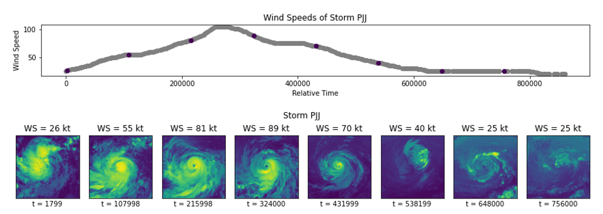

# Predicting Tropical Cyclone Severity: A CV-Based Approach

## Summary

Hurricanes are among the most destructive, costly, and deadly natural disasters occurring on Earth, and
are increasing in frequency and intensity with our warming climate. In this project, we fine-tune pretrained ResNet-18, SqueezeNet v1.1 and ShuffleNet v2 1.0x models provided by [Torchvision](https://pytorch.org/vision/stable/models.html) to predict the maximum sustained wind speed of a tropical cyclone from satellite imagery. We make use of the [Tropical Cyclone Wind Estimation Competition](http://registry.mlhub.earth/10.34911/rdnt.xs53up/) dataset hosted by RadiantMLHub, originally constructed by the NASA Interagency Implementation and Advanced Concepts Team (IMPACT) in a 2020 [paper](https://ieeexplore.ieee.org/document/9149719) by Maskey et. al, and thereafter leveraged by DrivenData to hold a crowdsourcing [competition](https://www.drivendata.org/competitions/72/predict-wind-speeds/).

Check out the:
- [Report](McDonald_CSE881_Project.pdf) for a comprehensive project summary,
- [Exploratory](explore_tropical_cyclones.ipynb) notebook to get a feel for the dataset at hand, or the
- [Modeling](model_tropical_cyclones.ipynb) notebook to see our architecture/training/validation/evaluation code.

## Contact

Please email Andrew McDonald at mcdon499 [at] msu [dot] edu with any questions, ideas, or comments. For more information about MSU's CSE 881 (Graduate Data Mining), check out the class [website](https://cse.msu.edu/~mayao4/cse881/index.html), course instructor Dr. Jiliang Tang's [website](https://www.cse.msu.edu/~tangjili/), or course TA Yao Ma's [website](https://cse.msu.edu/~mayao4/).
